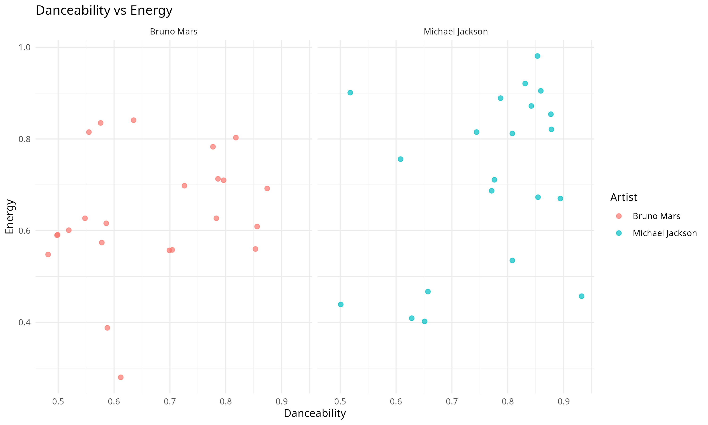
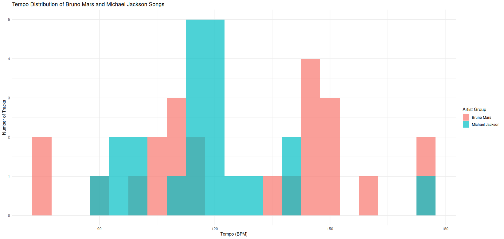
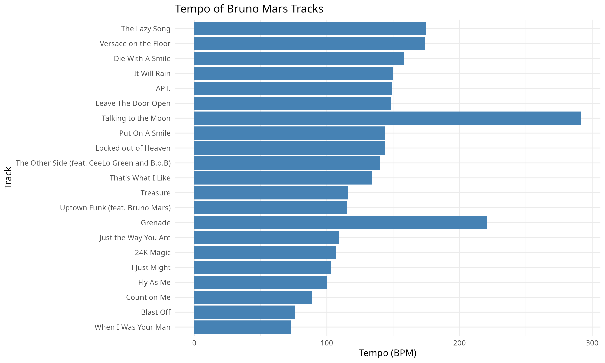
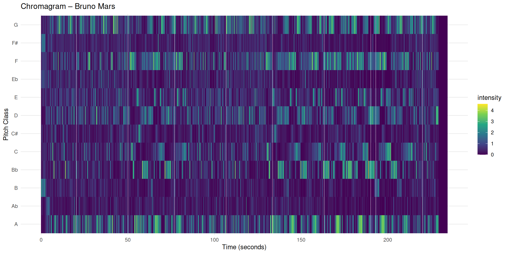
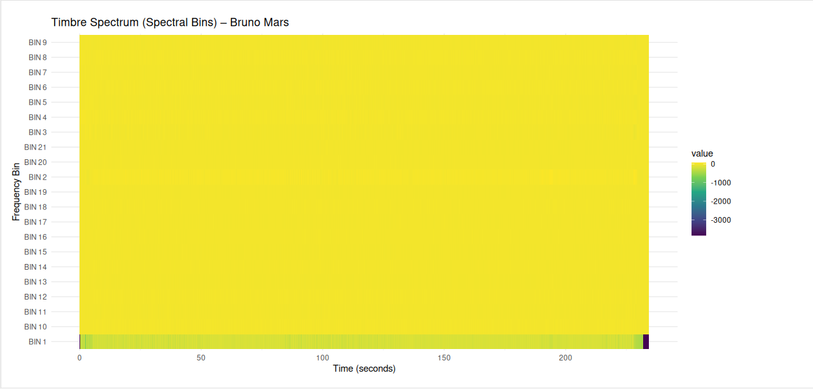
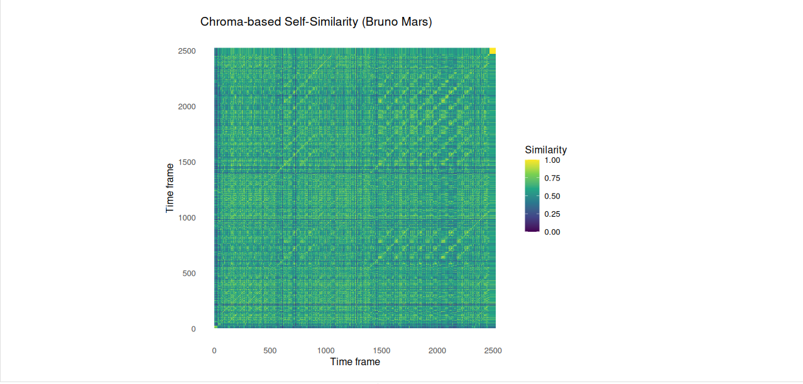
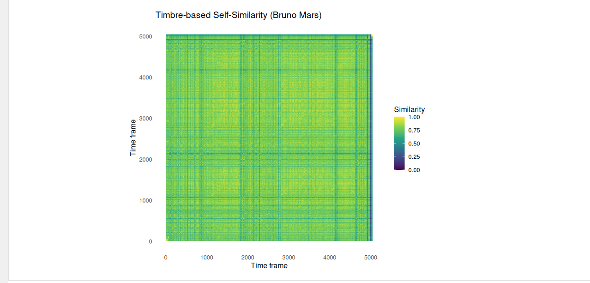

---
title: "Computational Musicology Portfolio"
author: "Noor Verbrugge"
format:
  dashboard:
    orientation: columns
    theme: journal
--- 

# Portfolio

## 

**Intro**

Computational musicology uses digital tools and data analysis to study musical structure, style, and performance. In this portfolio, I explore a small class corpus with songs by Bruno Mars and Michael Jackson. I use metadata such as tempo, danceability, energy, chromagrams, timbre features, tempo curves, and self-similarity matrices. The goal is to show how computational methods can reveal musical patterns that are harder to see by listening alone. In particular, I focus on structure, repetition, harmony, timbre, and tempo. Together, these visualisations give a clearer picture of how songs are organised over time.

-   Link naar GitHub repo
-   Link naar je data / notebooks
-   Wat staat waar?

**Corpus overview**

This section gives a general overview of the class corpus. I combine my Bruno Mars and Michael Jackson track lists into one dataset, so that I can compare the two groups visually. The scatterplot below shows the relationship between danceability and energy. This gives a first impression of how the songs are distributed stylistically.

```{r setup, include=FALSE}
library(readr)
library(tidyverse)
library(dplyr)
library(ggplot2)
library(tidyr)
library(forcats)
library(grid)

knitr::opts_chunk$set(message = FALSE, warning = FALSE)
```



**Analyse**

The scatterplot shows that both artist groups occupy a similar pop-oriented space, with generally moderate to high danceability and energy values. At the same time, there is still some variation across tracks, which suggests that not every song uses the same balance between groove and intensity.

# Tempo

## Histogram of Tempi in the Class Corpus

This histogram shows the distribution of tempo values in the class corpus. Each bar represents how many tracks fall within a certain BPM range. This helps us see whether the songs tend to cluster around certain tempo ranges.



Most songs in the corpus fall within a medium tempo range that is typical for pop music. The Bruno Mars and Michael Jackson songs overlap quite strongly in their tempo distributions, which suggests that both artists often work within similar tempo conventions.

**Tempo Curves for My Contributions**

A tempo curve shows how the estimated tempo changes over time in a track. Unlike the Spotify tempo value, which is only one average BPM value, a tempo curve can reveal small fluctuations or expressive timing differences during the song.

Instead of showing tempo changes within a single track, we can compare the overall tempo of the tracks in the corpus. This gives an idea of how fast different songs are relative to each other.



The tempo curve shows that the tempo remains relatively stable throughout the track. This is typical for studio-produced pop music, where the tempo is usually fixed during recording. Small variations may appear due to beat-tracking estimation or subtle timing differences in the performance.

# Chroma Features

## Chromagram – Locked Out of Heaven



This chromagram was created in Sonic Visualiser using NNLS Chroma features. It shows how the different pitch classes (C–B) are distributed over time in the song. Several pitch classes appear brighter and more consistent throughout the track. This suggests that the song has a stable tonal centre and stays in the same key for most of the time. This matches what I hear: the harmony does not change very much, especially in the chorus, where the same chord progression repeats.

At certain moments, the chroma intensity becomes stronger. These moments often match sections with higher musical energy, such as the chorus. The repeating horizontal patterns in the visualisation reflect the structured pop form of the song (verse–chorus–verse).

The chromagram clearly shows harmonic repetition and confirms that the song has a strong and stable tonal focus. Compared to more harmonically complex genres, the pitch activity is concentrated around a limited group of notes. This supports the song’s clear pop style and strong tonal identity.

```{r plot-timbre, fig.width=12, fig.height=6, out.width="100%"}
library(tidyverse)
bruno_tracks <- read_csv("Bruno_corpus.csv")
michael_tracks <- read_csv("Michael_corpus.csv")

tracks <- bind_rows(
  bruno_tracks  %>% mutate(artist_group = "Bruno Mars"),
  michael_tracks %>% mutate(artist_group = "Michael Jackson"))

tracks <- tracks %>%
  rename(
    track_name = `Track Name`,
    danceability = Danceability,
    energy = Energy,
    valence = Valence,
    tempo = Tempo,
    loudness = Loudness)

timbre_bruno <- read_csv("timbr_bruno.csv")

# Hernoem TIME naar time
timbre_bruno <- timbre_bruno %>%
  rename(time = TIME)
```

## Cepstrogram – Locked Out of Heaven




The timbre visualisation shows how spectral energy is distributed across 21 frequency bins over time. In other words, it shows how the sound colour (timbre) changes during the song.

Most frequency bins show relatively stable and strong intensity values throughout the track. This suggests that the production style is consistent and compressed. There are not a lot of changes in timbre between different sections of the song.

This corresponds to what I hear: the song keeps a steady, polished pop sound from beginning to end. There are slight increases in the lower frequency bins in some sections, which may reflect a stronger presence of bass or drums. However, the overall spectral balance remains quite constant.

This fits with the tight, radio-oriented production style that is typical of Bruno Mars’ recordings.







## 

**Comparing Chromagram and Cepstrogram**

The chroma-based self-similarity matrix shows clear block-like shapes along the main diagonal. These square or rectangular areas represent repeated harmonic sections, such as verses and choruses. The strong contrast between similar and different regions shows that harmony plays an important role in shaping the overall structure of the song. The repeating diagonal patterns reflect stable chord progressions and a consistent tonal centre.

In contrast, the timbre-based self-similarity matrix looks more uniform and dense. Although some structural boundaries are still visible, the contrast between sections is less strong. This suggests that while the harmony clearly repeats, the timbral characteristics (such as instrumentation, texture, and production details) remain relatively stable throughout the song.

Overall, the chroma matrix makes the formal harmonic structure easier to see, while the timbre matrix highlights the consistent and polished sound texture of the track.

# Classification

## Predicting artist

```{r classification-plot, fig.width=7, fig.height=5, out.width="100%"}
library(class)
library(ggplot2)
library(dplyr)

data_model <- tracks %>%
  select(artist_group, danceability, energy, valence, tempo, loudness) %>%
  drop_na()

set.seed(123)
train_index <- sample(1:nrow(data_model), 0.7 * nrow(data_model))

train_data <- data_model[train_index, ]
test_data  <- data_model[-train_index, ]

train_x <- train_data %>% select(-artist_group)
test_x  <- test_data %>% select(-artist_group)

train_y <- train_data$artist_group
test_y  <- test_data$artist_group

# Scale the features
train_x_scaled <- scale(train_x)
test_x_scaled <- scale(
  test_x,
  center = attr(train_x_scaled, "scaled:center"),
  scale = attr(train_x_scaled, "scaled:scale")
)

# KNN model
predictions <- knn(train = train_x_scaled, test = test_x_scaled, cl = train_y, k = 3)

# Accuracy
accuracy <- mean(predictions == test_y)

# Confusion matrix as dataframe
conf_matrix <- as.data.frame(table(Predicted = predictions, Actual = test_y))

# Plot
ggplot(conf_matrix, aes(x = Actual, y = Predicted, fill = Freq)) +
  geom_tile() +
  geom_text(aes(label = Freq), size = 6) +
  labs(
    title = paste("Confusion Matrix for KNN Classification\nAccuracy =", round(accuracy, 2)),
    x = "Actual Artist",
    y = "Predicted Artist",
    fill = "Count"
  ) +
  theme_minimal()
```


**Analyse** The classification model uses musical features such as danceability, energy, tempo, valence, and loudness to predict whether a track belongs to Bruno Mars or Michael Jackson. The KNN model achieves an accuracy of approximately `r round(accuracy, 2)`.

This result shows that there are measurable differences between the two artists, even though their music also overlaps in style. The model does not achieve perfect accuracy, which reflects the fact that both artists operate within a similar pop genre. However, the model is still able to capture subtle stylistic patterns in the data.
